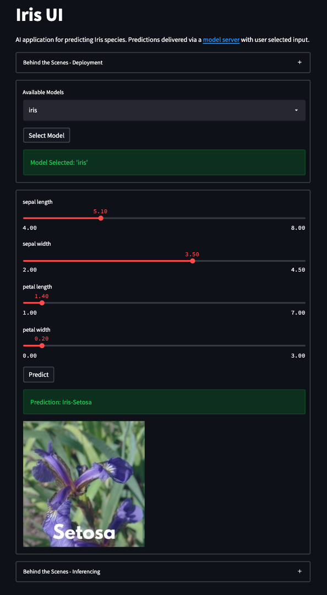
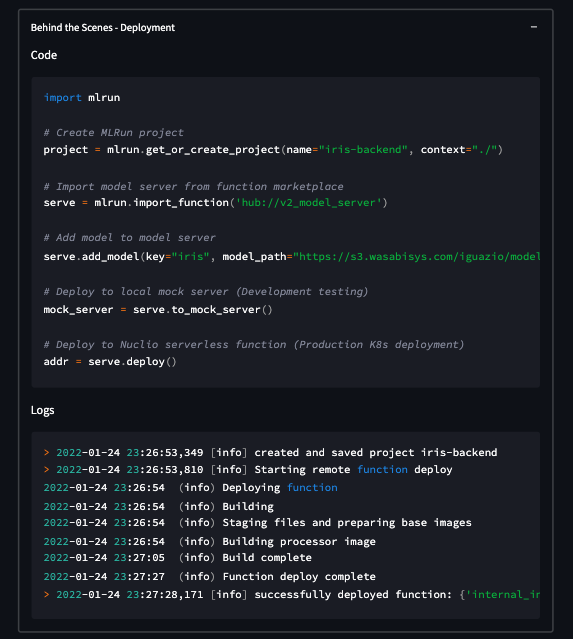
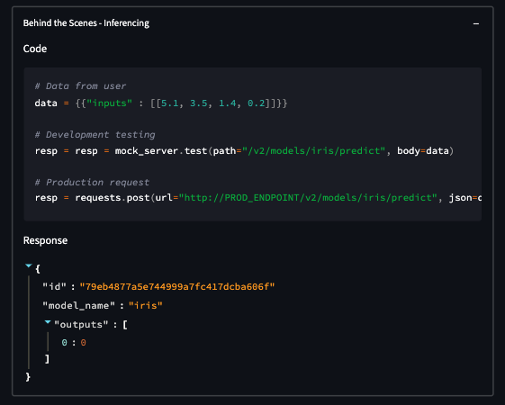

# MLRun AI Apps

## Overview
This is a simple [Streamlit](https://streamlit.io/) application that connects to a backend [MLRun model serving function](https://docs.mlrun.org/en/latest/serving/model-serving-get-started.html).

It not only an interactive example, but also a showcase for how simple it is to deploy a model on the `MLRun` side and interact on the `Streamlit` side. There are two `Behind The Scenes` sections highlighting both of these topics.

### Main Application


### Behind the Scenes - Deployment


### Behind the Scenes - Inferencing


## 0. Prerequisites
- [docker-compose](https://docs.docker.com/compose/) installed on your local machine

## 1. Deploy via Docker Compose
To deploy this application, run the following command in this directory:
```bash
docker-compose up -d --build
```
This will build the image and deploy the `Streamlit` application on your local machine.

## 2. Use the Streamlit App
To use the application:
1. Navigate to http://localhost:8501 in the browser to access the app
2. Select the desired model - there should only be `iris` available
3. Adjust the sliders for submitting data
4. Press `Predict` to send the data to the model server and receive a prediction

## 4a. Delete via Docker Compose
To delete this application, run the following command:
```bash
docker-compose down
```