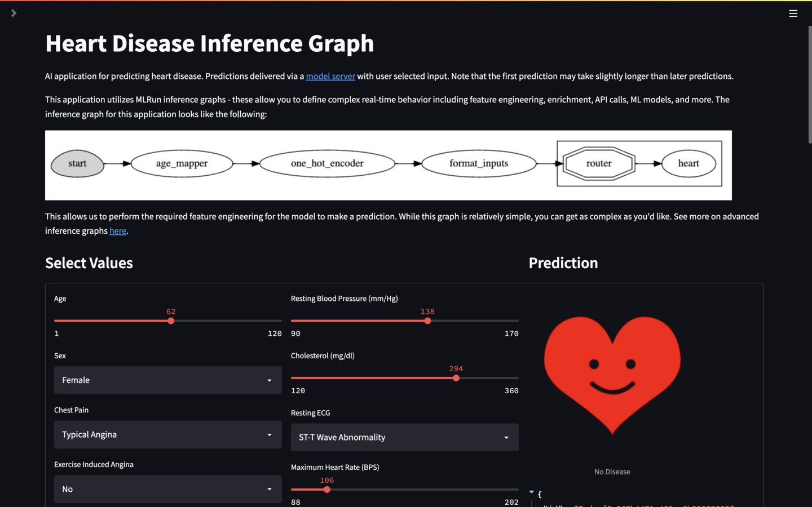
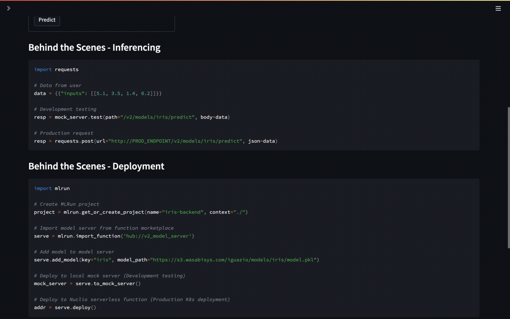

# MLRun AI Apps

## Overview
This is a simple [Streamlit](https://streamlit.io/) application that showcases how to utilize [MLRun](https://www.mlrun.org/) in the context of a larger ML application.

Within this app, there are multiple demos with interactive UI's that inference live machine models via [MLRun model serving functions](https://docs.mlrun.org/en/latest/serving/model-serving-get-started.html).

    
    <figcaption align="center">Heart Disease Prediction UI</figcaption>

In addition to the interactive UI, there are also short code snippets that show the "behind the scenes" of how the models are deployed and inferenced within the application.

    
    <figcaption align="center">Iris Inferencing and Deployment</figcaption>

## Getting Started
There are 2 ways to get started:

### 1. Web Hosted
Simply go to https://mlrun-ai-apps.herokuapp.com/ and immediately start using the app. No installation required!

*Note it may take a minute for the app to wake up*

### 2. Local Deployment
To deploy the applicaiton locally on your own machine, follow the [local deployment instructions](doc/docker_compose_deployment.md) using `docker-compose`
